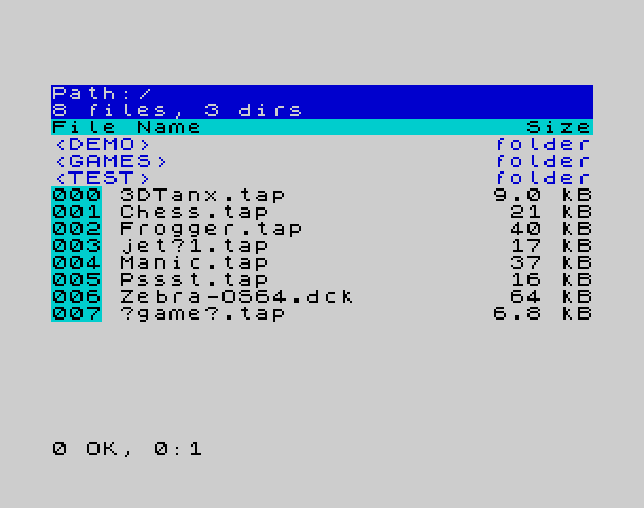
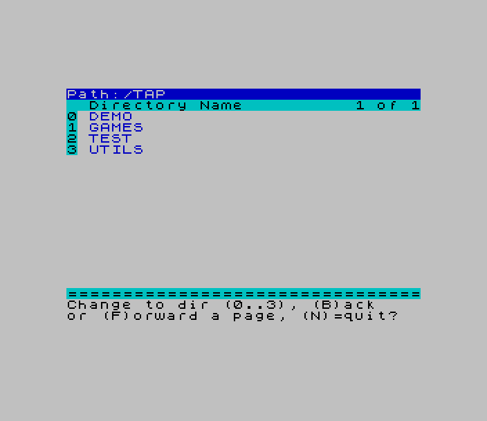
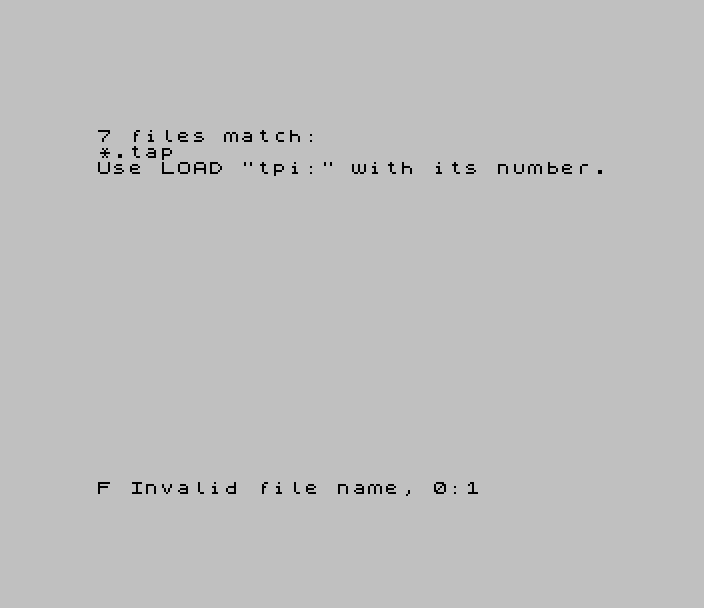
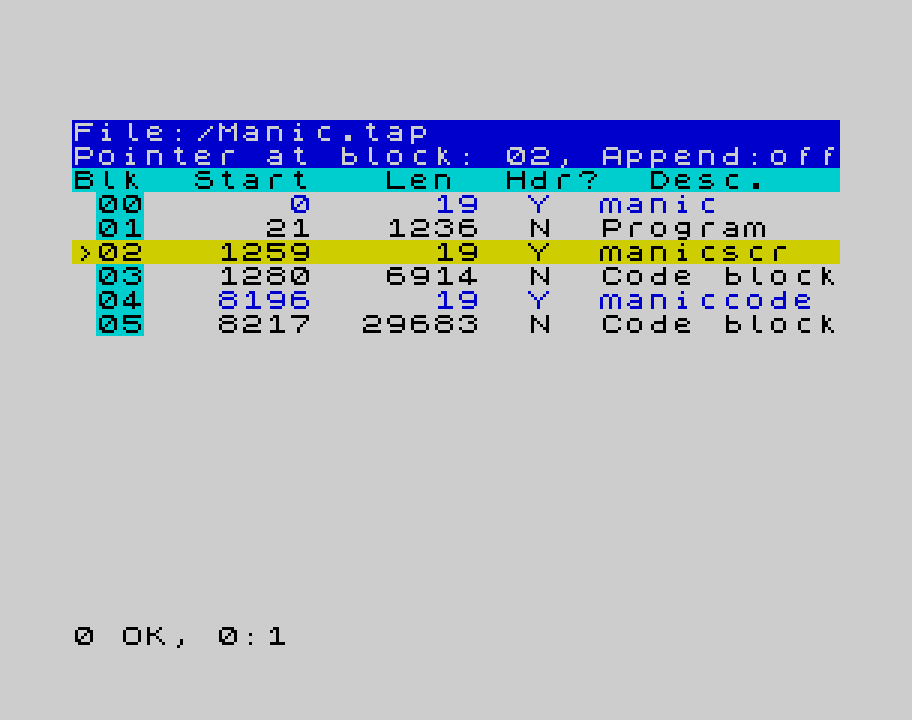
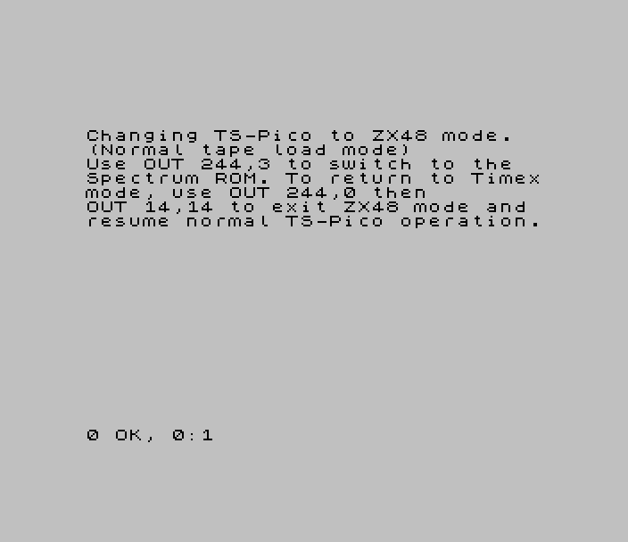
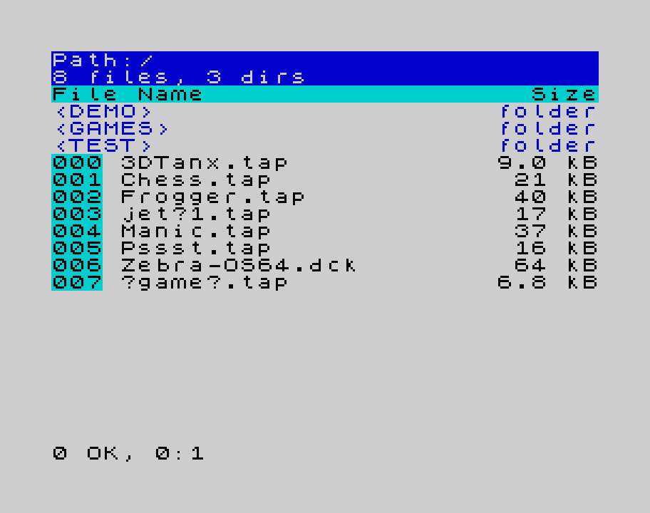
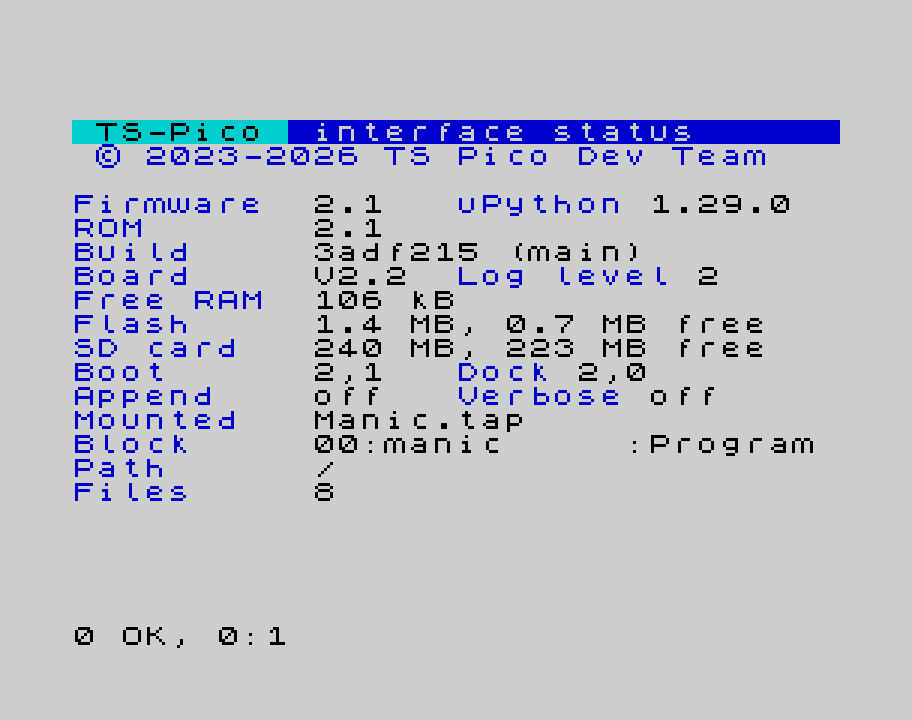

# TS-Pico User Manual

### For the TS-Pico Interface for the Timex Sinclair 2068 — version 2.2

## Contents

1. Meet the TS-Pico
2. Installing Your TS-Pico
3. Getting Around: Files, Folders and Tapes
4. Loading and Saving
5. Native Files with `f:`
6. Streams and Channels: `OPEN #`
7. The Virtual Printer
8. ROM Slots, Cartridges and the Flash Chip
9. ZX Spectrum Mode
10. Command Reference
11. When Things Don't Go As Expected

Appendices

- A. Upgrading Your TS-Pico
- B. Reports at a Glance
- C. Command Quick Reference
- D. Settings, `config.ini` and TPMODE
- E. The TS-Pico Team

---

# Chapter 1: Meet the TS-Pico

## 1.1 What is the TS-Pico?

Remember loading programs from cassette? You'd press PLAY, wait while the tape warbled, and
hope nothing went wrong at minute four. The TS-Pico retires the cassette. It plugs into the
2068's expansion connector and keeps your programs on a micro SD card, in the same **TAP**
files that emulators use. A `LOAD ""` that took minutes now takes a moment.

Inside is a Raspberry Pi **Pico** running MicroPython. It talks to the 2068 through two I/O
ports and looks after the SD card. Next to it on the board are:

- **512K of Flash memory**, holding sixteen 32K "slots": the TS-Pico 2068 ROM, a ZX Spectrum
  ROM, a few utility ROMs and cartridges, and room for your own;
- **512K of static RAM**, sixteen more slots that are lost when the power goes off.

The TS-Pico replaces part of the 2068's own ROM with its own version, so the ordinary
commands **LOAD**, **SAVE**, **VERIFY** and **MERGE** go to the SD card, and a family of new commands
lets you look after files and folders.

**What you can do with it:**

- Load and save programs, screens, code and data to TAP files on the SD card
- Browse, create, copy, rename and delete files and folders
- Save a program as a plain file (`foo.bas`, `foo.scr`), not only inside a TAP
- Read and write text and data files from BASIC with `OPEN #`, `PRINT #` and `INPUT #`
- Capture `LPRINT`, `LLIST` and `COPY` to text and picture files
- Run cartridges (DCK files) and alternative ROMs from the Flash slots
- Switch the 2068 into a ZX Spectrum and load Spectrum tapes

## 1.2 How TS-Pico commands work

Almost everything the TS-Pico does is reached through a filename that starts with `tpi:`. When
the 2068 sees `SAVE "tpi:..."`, it doesn't save anything; it sends the rest of the name to
the TS-Pico as a command.

```basic
SAVE "tpi:dir"
```

That's the directory command. The rules are simple:

- **Commands use SAVE.** `SAVE "tpi:dir"`, `SAVE "tpi:cd games"`, `SAVE "tpi:info"`.
- **LOAD "tpi:..." mounts a file.** `LOAD "tpi:frogger.tap"` makes `frogger.tap` the "tape" that
  `LOAD ""` reads from. There are no other LOAD commands.

  > **Coming from version 1.1?** Version 1.1 used `LOAD "tpi:dir"`, `LOAD "tpi:path"` and so on.
  > In this version they are all `SAVE` commands. `LOAD "tpi:dir"` now tries to mount a file
  > called `dir`, and gives Report F.

- **Upper or lower case doesn't matter** in the command word: `tpi:DIR`, `tpi:dir` and `TPI:Dir`
  all work.
- **Anything after a space is the argument:** `SAVE "tpi:cd games"`.
- **Some commands take numbers** after the name, written the way you'd save a block of code:

  ```basic
  SAVE "tpi:dir" CODE 1,5
  ```

  Nothing is saved. The two numbers (we'll call them *a* and *b*) are just passed to the
  command, and each command says what they mean. Leaving `CODE` off is the same as `CODE 0,0`.

The disk commands also have their own keywords, so you can type `CAT` instead of
`SAVE "tpi:dir"`. We'll use both as we go.

## 1.3 Quiet or chatty: VERBOSE

Out of the box, most TS-Pico commands work quietly: a successful command just gives you
**0 OK**, and a failed one gives you a report such as **F Invalid file name**. That keeps
programs tidy. While you're learning, you'll probably want to see what's going on:

```basic
SAVE "tpi:verbose" CODE 1,1
```

Now commands tell you what they did ("Changed dir to: games") and why they failed ("File does
not exist: frogr.tap"). Turn it off again with `CODE 1,0`. Some commands, such as **DIR**, **PATH**,
**INFO** and the listings, always show their output whatever the setting. Where a message in
this manual appears only in verbose mode, we say so.

## 1.4 The reports you'll see

When something goes wrong, the TS-Pico hands the 2068 a status, and the 2068 turns it into one
of its familiar reports at the bottom of the screen:

| Report | What it usually means with the TS-Pico |
|---|---|
| **0 OK** | Done |
| **F Invalid file name** | The file or folder isn't there, or the name isn't allowed |
| **Q Parameter error** | The command understood you but can't do it (file in use, not empty, wrong mode…) |
| **A Invalid argument** | A `CODE a,b` or an argument the command doesn't accept |
| **C Nonsense in BASIC** | An unknown `tpi:` command, or extra words the command doesn't expect |
| **R Tape loading error** | Data was damaged on the way, or a TAP file is damaged |
| **8 End of file** | You read past the end of a file, or a LOAD found nothing matching |
| **6 Number too big** | A number out of range, such as a file index |
| **D BREAK - CONT repeats** | You pressed BREAK, or answered N to a "Replace?" question |
| **J Invalid I/O device** | The TS-Pico didn't answer. See Chapter 11 |
| **T TS-Pico reset, try again** | The TS-Pico gave up on a transfer and reset itself. Just try again |

Appendix B has the full list.

## 1.5 Summary

1. The TS-Pico keeps your programs on a micro SD card and makes LOAD and SAVE fast.
2. `SAVE "tpi:command"` sends a command; `LOAD "tpi:file"` mounts a file.
3. `CODE a,b` after a command passes it two numbers.
4. Turn on `SAVE "tpi:verbose" CODE 1,1` to see messages while you learn.
5. Errors come back as ordinary 2068 reports.

---

# Chapter 2: Installing Your TS-Pico

> **Chapter Preview.** Fitting the board, a tour of its buttons, jumpers and light, getting an
> SD card ready, what happens when you switch on, and your first command.

## 2.1 Before you begin

You'll need:

- your Timex Sinclair 2068 and its power supply;
- the TS-Pico board;
- an expansion bus board, if you use one (the TS-Pico can also plug straight into the 2068);
- a micro SD card. Your TS-Pico came with one, already set up.

**Always switch the 2068 off before you connect or disconnect anything**, and take out any
cartridge in the 2068's cartridge slot.

## 2.2 Fitting the board

There are two ways to connect the TS-Pico.

**Direct connection.** The TS-Pico plugs straight into the expansion connector at the back
right of the 2068 and sticks out behind it.

**On an expansion bus.** The bus board plugs into the 2068, and the TS-Pico plugs into one of
its slots. While any slot works; many people use the one nearest the 2068.

> **Important: the BUSISO jumpers/switches.** The expansion bus has "BUSISO bypass" jumpers 
> or switches on its
> right-hand side, between the card-edge connectors. 
>
> On expansion boards with a jumper, the jumper for the TS-Pico's slot **must be removed**, or 
> the TS-Pico won't work. Park the jumper on a single pin so it doesn't get lost.
>
> On expansion boards with switches, slide the towards the 2068. The other switches should 
> be towards the back of the board, away from the 2068.

Both connectors are keyed, so they only go in one way. Expect a fair amount of resistance when
you press the board home. That's normal. If you find yourself forcing it, stop and check that
the key lines up with the notch.

## 2.3 A tour of the board

**The Pico** is the small green board with a white **BOOTSEL** button and a Micro-USB socket.
You only need the USB socket for updating the firmware (Appendix A). In normal use the TS-Pico
takes its power from the 2068.

**The buttons.** The TS-Pico has three pushbuttons:

- **TS Reset** restarts the 2068, just like its own reset. The TS-Pico keeps its state: the
  mounted file, the current folder and so on.
- **Pico Reset** restarts the Pico. Use it only as a last resort, and never while a file is
  being written.
- **NMI** isn't used by the standard ROM.

**The light.** The Pico's green LED tells you what it's doing:

| What you see | What it means |
|---|---|
| A short flash every couple of seconds | Idle and happy, waiting for a command |
| Steady on | Busy with a command, a SAVE or a listing |
| Flickering | Copying a file you've just mounted |
| A burst of fast blinks | Something went wrong, for example a file that wouldn't mount |
| Two short flashes every couple of seconds | Running without an SD card (see 2.6) |

**The jumpers.**

- **P10** enables writing to the Flash chip. Keep it fitted: you need it to update the ROM and
  to put cartridges and ROMs into the Flash slots.
- **JP4** chooses the TS-Pico's I/O port range. Leave it on the default `$00..$0F` setting (the
  TS-Pico uses ports 14 and 15).
- **JP1** lets the TS-Pico cooperate with a device plugged in "behind" it on an expansion bus.
- **JP2, JP3 and JP5** are for wiring remote copies of the buttons, for example in a case.

**The SD card slot** is at the upper right corner of the TS-Pico board. The card goes in
contacts first and clicks into place.

## 2.4 The micro SD card

Your card came ready to use. If you set up a new one:

1. Format it **FAT32** on your computer. Cards up to 16GB work.
2. Create a folder called **`TAP`** at the top level of the card. This is essential: the
   TS-Pico treats `TAP` as its root folder, and won't start without it.
3. Copy your `.tap` files into `TAP`, or into folders inside it.
4. If you like, copy the `help` folder from the TS-Pico release to the top level of the card,
   next to `TAP`. That's where `SAVE "tpi:help word"` finds its help pages.

**Naming files.** Stick to letters, digits, `-` and `_` for anything you'll SAVE from the 2068. The TS-Pico accepts longer names and spaces when *loading*, but a plain `SAVE "name"` only allows letters, digits, `-` and `_`.

## 2.5 Switching on

Now switch the 2068 on. Here's what happens:

1. For a couple of seconds the screen may look frozen or garbled. That's normal: the Pico is
   starting up.
2. The Pico's LED blinks steadily while it opens the SD card and reads your `TAP` folder.
3. The 2068 starts. You'll see the usual copyright lines, plus the TS-Pico's own line, which
   includes the ROM version, for example `2026 TS-Pico ROM v2.2`.
4. Press **ENTER** and the flashing **K** cursor appears.

Let's make sure everything's talking:

```basic
SAVE "tpi:dir"
```

You should see a listing of your `TAP` folder, even if it's empty:

```
Path:/TAP
SD: 7.4453GB; free: 7.2109GB
File Name                   Size
--------------------------------
<GAMES>                      0 B
000 frogger.tap         12.00 kB
    notes.txt              300 B
```

Folders come first, in angle brackets. Each file the TS-Pico can mount (TAP, DCK, ROM, BIN)
gets a three-digit **index number**. Other files, such as `notes.txt`, are listed without one.

How about that? Your TS-Pico is working. Plain `CAT` does the same thing.

## 2.6 If the SD card isn't found

The TS-Pico keeps running without an SD card. You'll know there isn't one because the LED
gives **two** short flashes every couple of seconds instead of one, and any command that needs
the card says so:

```
No SD card. Insert one and
try again.
J Invalid I/O device, 0:1
```

Commands that don't need the card, such as `SAVE "tpi:info"`, keep working, and so does
`LOAD ""` from a TAP you mounted earlier. A `SAVE` is refused before anything is sent, so your
program is still in memory: put a card in and SAVE again.

1. **Put the card in, or take it out and push it back in.** Pulling the card out switches it
   off, and it wakes up fresh when you put it back.
2. **Type the command again.** The TS-Pico looks for the card every time, so there's nothing
   else to do. You should see your directory listing.

A freshly formatted card works too: the TS-Pico makes the `TAP` folder on it.

**Swapping cards.** You can change cards while the 2068 is on. The next command that reads the
card (a `CAT` or `SAVE "tpi:dir"` will do) notices it's a different card and reads it
afresh. You stay in the same folder if the new card has it, and the mounted TAP stays mounted
if the new card has that file too; otherwise you're back at the top, with nothing mounted.
Append is switched off, so a SAVE can't land in a file on the other card, and any files open
with `OPEN #` are closed.

If the card still isn't found, give the whole system a fresh start:

1. **Switch the TS 2068 off.**
2. **Unplug the Pico's USB cable**, if it's connected to a computer.
3. **Wait a few seconds, then switch the TS 2068 back on.**

**Why does this happen?** It's most common after a *warm boot*: the TS-Pico restarted while it
stayed powered, for example after a firmware update with the USB cable connected. The SD card
stays powered through the restart and can be left waiting for something that never arrives. It
only recovers once it loses power. Taking the card out, or switching everything off, does
exactly that.

If a card still isn't found after that, try it in a computer: it may need formatting (FAT32),
or it may be write-protected, in which case the TS-Pico can't make its `TAP` folder.

## 2.7 Summary

1. Switch the 2068 off before connecting anything, and remove the BUSISO jumper for the
   TS-Pico's slot on an expansion bus.
2. Keep the P10 jumper fitted.
3. Your files live in the SD card's `TAP` folder; the TS-Pico makes it on a blank card.
4. A short LED flash every couple of seconds means all is well.
5. Two LED flashes mean there's no SD card. Put one in, or reseat it, and type the command
   again; if that doesn't do it, switch off with the USB unplugged.

---

# Chapter 3: Getting Around: Files, Folders and Tapes

## 3.1 What's on the card? DIR and CAT

You've already met the directory listing:

```basic
SAVE "tpi:dir"
```

Or you can use the **CAT** command. The listing shows the folder you're in (the
*current folder*), how big the card is and how much space is free, then folders, then files.
If it's longer than the screen, you'll see `Scroll? (Y/n)` with a percentage showing how far
through you are. Press **Y** or **ENTER** for more, a number **1** to **9** to scroll that many
lines, or **N** to stop.

`CAT` can do more than list the current folder:

```basic
CAT "games"          : REM a different folder, without going there
CAT "*.tap"          : REM only the TAP files
CAT "games/b*"       : REM files in games starting with b
CAT "frogger.tap"    : REM the blocks inside a TAP file
CAT ""               : REM the blocks inside the mounted TAP
```

`*` matches any run of characters and `?` matches exactly one. They work in the last part of a
path. `SAVE "tpi:dir games"`, `SAVE "tpi:dir *.tap"` and so on give the same listings, as long
as the whole name fits in 31 characters.



*`CAT` on a card with four folders and eight files. `{game}.tap` and `jet~1.tap` appear as
`?game?.tap` and `jet?1.tap`; see below.*

> **By the way:** `SAVE "tpi:dir"` checks the card before it lists the folder. After you swap
> cards you see the new card, and if you take the card out, add files from a computer and put
> it back, the new files are there too. No restart needed.

**Names with characters the 2068 can't show.** A file named on a computer can contain characters
the 2068 doesn't have on its keyboard or prints as something else: `|` and `~` come out as the
keywords STICK and FREE, `{` and `}` can come out as ON ERR and SOUND, and accented letters
don't exist at all. The listing shows each of them as `?`, for example `?game?.tap` for
`{game}.tap`. You can type the name just as it's shown; see the next section.

## 3.2 Folders: CD, MOVE TO and PATH

To go into a folder:

```basic
SAVE "tpi:cd games"
```

or:

```basic
MOVE TO "games"
```

To see where you are:

```basic
SAVE "tpi:path"
```

```
Current working dir is:
/TAP/GAMES
```

A few special names help you get around:

| Name | Takes you to |
|---|---|
| `..` | The folder above. You can't go above the root. |
| `/` | The root, the card's `TAP` folder |
| `-` | The folder you were in before the last change |
| `games/arcade` | A folder inside a folder |
| `/games` | A path from the root |

`MOVE TO ""` is the same as `SAVE "tpi:cd -"`: back to where you were.

**Picking a folder from a list.** Type `SAVE "tpi:cd"` on its own and the TS-Pico shows the
folders here as a numbered menu. Press a digit **0**-**9**, or **Q W E R T Y** for items
10 to 15, to go into one; **B** goes back a page, any other key goes forward, and **N**
quits. `SAVE "tpi:cd" CODE 0,1` lists every folder on the card instead.



*The `SAVE "tpi:cd"` menu, waiting for a key.*

**Making a folder:**

```basic
SAVE "tpi:md tools"
FORMAT "tools/"      : REM the same (note the slash)
```

`SAVE "tpi:md tools" CODE 1,0` makes the folder and goes into it.

## 3.3 Mounting a TAP file

A TAP file is a recording of a cassette: a series of blocks, just as they'd appear on tape.
To use one, you **mount** it. Think of it as putting the cassette in the player:

```basic
LOAD "tpi:frogger.tap"
```

Now `LOAD ""` loads from that file, one program after another, just as a tape would. The
TS-Pico copies the TAP into its own memory while it mounts it. The LED flickers for a moment,
and big files take a second or two.

You can also mount a file by the **index number** shown in the listing:

```basic
LOAD "tpi:0"         : REM the file listed as 000
LOAD "tpi:12"
```

**Remember:**

- Mounting only looks in the **current folder**. Use `MOVE TO` or `tpi:cd` first.
- Only TAP, DCK, ROM and BIN files can be mounted. DCK, ROM and BIN files are cartridges and
  ROM images; they're covered in Chapter 8. TZX files are listed, but the TS-Pico can't mount
  them.
- If the name isn't found, you'll get **F Invalid file name**. A file you've just copied onto
  the card from a computer is found without a restart.
- **Type a `?` where the listing shows one.** `LOAD "tpi:?game?.tap"` mounts `{game}.tap`. A
  `?` stands only for a character the 2068 can't show, so it won't pick `(game).tap` by
  mistake. A `*` stands for any run of characters: `LOAD "tpi:fro*"` mounts `frogger.tap` if
  it's the only match. When several files match, the TS-Pico says how many and asks you to use
  the file's number instead:

  

**Picking a file from a list.** `SAVE "tpi:idir"` shows the mountable files as a menu, using
the same keys as `tpi:cd`, and mounts the one you pick.

## 3.4 Looking inside a TAP

To see what's in the mounted TAP:

```basic
SAVE "tpi:tapdir"
CAT ""               : REM the same
```



*`CAT ""` with `Manic.tap` mounted and the tape pointer at block 02.*

Each program on a tape is two blocks: a short **header** (`Y` in the Hdr? column) carrying its
name, and the data itself, described by its type. The `>` marks the **tape pointer**, the block
the next `LOAD` will start from.
`SAVE "tpi:tapdir" CODE 1,0` shows one line per program or file instead of one per block.
`CAT "other.tap"` shows the contents of any TAP, mounted or not.

## 3.5 Winding the tape: FFW and REW

Just like a cassette, you can wind the tape forward or back:

```basic
SAVE "tpi:ffw"             : REM forward one block
SAVE "tpi:rew" CODE 0,3    : REM back three blocks
SAVE "tpi:ffw" CODE 2,1    : REM forward to the next program or file
SAVE "tpi:rew" CODE 3,2    : REM back two files, then show the tape
```

With verbose on you'll see `Moved ahead to block # 4`. The tape stops at either end: you'll
get `Can't FWD. Already at end.` rather than a wrap-around, or `Can't FWD. No later file.` when
you skip by files from the last program.

## 3.6 Ejecting the tape: CLOSE

```basic
SAVE "tpi:close"
```

This unmounts the file. It's always safe, even with nothing mounted.

## 3.7 LOAD "" with nothing mounted

If nothing is mounted and you type `LOAD ""`, the TS-Pico loads a little menu program instead:

- **H** shows the TS-Pico's built-in help;
- **C** gives help on a single command;
- **P** lets you pick a file from any folder and load it;
- **F** starts the **TS-Pico Commander**, a full-screen file manager;
- **R** shows your ROM version;
- **I** shows TS-Pico information;
- **Q** quits.

To get the menu back at any time: `SAVE "tpi:close"` then `LOAD ""`.

The Commander lets you browse with the cursor keys, press **ENTER** to go into a folder or
mount a file, and use single keys for most TS-Pico commands. Press **?** in the Commander to
see them all.

## 3.8 Summary

1. `CAT` (or `SAVE "tpi:dir"`) lists files; patterns such as `"*.tap"` narrow it down.
2. `MOVE TO "folder"` (or `SAVE "tpi:cd folder"`) changes folder; `..`, `/` and `-` help you move.
3. `LOAD "tpi:name.tap"` mounts a file, by name or by index number.
4. `CAT ""` (or `SAVE "tpi:tapdir"`) shows what's inside the mounted TAP.
5. `SAVE "tpi:ffw"` and `SAVE "tpi:rew"` move the tape pointer; `SAVE "tpi:close"` ejects.

---

# Chapter 4: Loading and Saving

## 4.1 LOAD, VERIFY and MERGE

Once a TAP is mounted, all the loading commands work exactly as they would with tape:

```basic
LOAD ""                  : REM the next program on the tape
LOAD "frogger"           : REM the program called frogger
LOAD "" CODE             : REM the next block of code
LOAD "" SCREEN$          : REM a picture
LOAD "" DATA a$()        : REM an array
VERIFY ""
MERGE ""
```

The TS-Pico starts at the tape pointer and skips blocks that don't match what you asked for.
When it reaches the end, it goes back to the start, like rewinding. If it goes all the way
round without finding a match, you get **8 End of file**, instead of the endless wait you'd
get with a real tape.

## 4.2 SAVE

When the TS-Pico is your storage device (it is when you switch on), a plain SAVE writes a
**new TAP file** in the current folder, named after your program:

```basic
SAVE "mygame"            : REM makes mygame.tap
SAVE "mygame" LINE 10    : REM the same, starting at line 10 when loaded
SAVE "pic" SCREEN$
SAVE "code" CODE 32768,1000
```

**Remember:**

- A plain SAVE name may only use **letters, digits, `-` and `_`**. Spaces or other symbols give
  **F Invalid file name** before anything is written.
- Saving over an existing name **replaces that file without asking**.
- If nothing was mounted, the new file becomes the mounted file.
- An empty program gives **A Invalid argument**.

> **Note:** the TS-Pico says "0 OK" as soon as it has your data, and then writes it to the
> card. If the card fails at that moment (for example because it was pulled out), the error
> goes to the TS-Pico's log (`SAVE "tpi:log"`), not to the screen.

## 4.3 Adding to a TAP: APPEND and NEWTAP

Sometimes you want several programs in one TAP, like a real cassette. That's what **append**
mode is for:

```basic
LOAD "tpi:collection.tap"
SAVE "tpi:append" CODE 1,1     : REM or SAVE "tpi:append on"
SAVE "one"
SAVE "two"
SAVE "tpi:append off"
```

With append on, every SAVE is added to the end of the mounted TAP; the name you give is kept
in the tape header but doesn't name a file. `SAVE "tpi:append"` on its own tells you whether
it's on. Mounting any file turns it off.

To start a fresh, empty TAP and switch append on in one go:

```basic
FORMAT "collection.tap"        : REM refuses if the file exists
SAVE "tpi:newtap collection"   : REM the same
```

> **Note:** neither command touches a file that's already there. Both answer **F**, and
> `tpi:newtap` shows `File exists:` when VERBOSE is on.

## 4.4 Using a real cassette recorder

The TS-Pico can step aside and let the 2068 use its cassette port again:

```basic
SAVE "tpi:tape"      : REM LOAD and SAVE use the cassette recorder
SAVE "tpi:sdcard"    : REM back to the TS-Pico (the setting at switch-on)
```

`tpi:` commands keep working in tape mode; only plain LOAD, SAVE, VERIFY and MERGE go to
tape. Printing stays where it was (Chapter 7). You can check the setting with `PRINT PEEK 24027`; see Appendix D.

## 4.5 Summary

1. LOAD, VERIFY and MERGE read the mounted TAP from the tape pointer, wrapping once.
2. SAVE writes `name.tap` in the current folder; names are letters, digits, `-` and `_`.
3. Append mode adds SAVEs to the mounted TAP; `FORMAT "x.tap"` starts a new one.
4. `SAVE "tpi:tape"` and `SAVE "tpi:sdcard"` switch between cassette and TS-Pico.

---

# Chapter 5: Native Files with `f:`

## 5.1 Why native files?

A TAP file is a whole cassette. Sometimes you just want one file: `advent.bas`, `title.scr`,
`sprites.bin`. You can copy it to and from your computer, and it doesn't disturb the mounted
TAP or its tape pointer. That's what the `f:` prefix is for. Put it in front of a name, and
SAVE and LOAD talk straight to a file on the card:

```basic
SAVE "f:advent.bas" LINE 10
LOAD "f:advent.bas"
```

Everything you can save to tape, you can save this way:

```basic
SAVE "f:title.scr" SCREEN$
SAVE "f:sprites.bin" CODE 50000,768
SAVE "f:scores.dat" DATA s()
LOAD "f:title.scr" SCREEN$
LOAD "f:sprites.bin" CODE
LOAD "f:scores.dat" DATA s()
VERIFY "f:advent.bas"
MERGE "f:subs.bas"
```

The name can include a folder: `SAVE "f:games/advent.bas"`. The extension is up to you;
the TS-Pico knows the file's type from the file itself.

## 5.2 Replacing a file

If the file already exists, SAVE asks first, at the bottom of the screen so it doesn't spoil a
picture you're saving:

```
Replace advent.bas? (Y/N)
```

Press **Y** to replace it. Any other key cancels the SAVE with **D BREAK - CONT repeats**, and
the old file is left alone.

## 5.3 What's in the file

Programs, code and arrays are stored with a 128-byte **+3DOS header**, the same format the
Spectrum +3 and most modern Spectrum tools use, followed by the data. A SCREEN$ is stored as
the plain 6912 bytes of the screen, so you can open it in picture tools that understand
Spectrum screens.

A plain file of bytes with no header, such as something from your computer, can still be
loaded as CODE: `LOAD "f:font.bin" CODE 60000` puts the whole file at 60000.

## 5.4 If something goes wrong

| What you see | Why |
|---|---|
| **F Invalid file name** | The file or its folder isn't there, or the name isn't allowed |
| **Q Parameter error** | The name is a folder; the file is the mounted TAP; or you asked for the wrong type (for example, `LOAD "f:title.scr"` without `SCREEN$`) |
| **R Tape loading error** | The file is shorter than its header says |
| **D BREAK - CONT repeats** | You answered anything but Y to "Replace?" |

With verbose on, the TS-Pico says which, for example `advent.bas holds a program`.

## 5.5 Summary

1. `SAVE "f:name"` and `LOAD "f:name"` work with a single file, not a TAP.
2. Every kind of SAVE and LOAD works: programs, CODE, SCREEN$, DATA, VERIFY and MERGE.
3. The mounted TAP and its tape pointer are untouched.
4. Replacing a file asks first.

---

# Chapter 6: Streams and Channels: `OPEN #`

> Using the 2068's own PRINT #, INPUT # and LIST # statements to write and
> read text files, keep records you can jump to by number, and read a folder listing into a
> program. Each idea comes with a short program to try.

## 6.1 Streams in a nutshell

You already use streams without knowing it. `PRINT` goes to stream 2, the screen, and `INPUT`
comes from the keyboard. The 2068 has sixteen streams, numbered 0 to 15, and **OPEN #** connects
one to a device. The TS-Pico adds two new kinds of device:

- `"f:name"`, a file on the SD card;
- `"d:pattern"`, a list of file names.

```basic
OPEN #4,"f:notes.txt","w"
```

This connects stream 4 to `notes.txt` for **writing**. Now everything you `PRINT #4` goes into
the file, and `CLOSE #4` finishes it off. Streams 4 to 15 are free for your use. Each open
file borrows 512 bytes of the 2068's memory until you close it.

**The modes:**

| Mode | Meaning |
|---|---|
| `"r"` | **Read** (the default if you leave the mode off). The file must exist. |
| `"w"` | **Write**. Creates the file, or empties it if it's already there. |
| `"a"` | **Append**. Adds to the end, creating the file if needed. |
| `"u"` | **Update**. Read and write. Creates the file if needed. |

Add `b` for **binary** (`"rb"`, `"wb"`, `"ab"`, `"ub"`). Without it, files are **text**: the
TS-Pico turns the 2068's line ends and keywords into ordinary text that you can read on any
computer, and back again.

## 6.2 Writing a text file

Let's try it. Type this program and RUN it:

```basic
10 OPEN #4,"f:shopping.txt","w"
20 PRINT #4;"Eggs"
30 PRINT #4;"Milk"
40 PRINT #4;"Bread, 2 loaves"
50 CLOSE #4
60 PRINT "Saved."
```

Nothing appears on the screen until line 60, because lines 20 to 40 went to the file. Put the
card in your computer and open `shopping.txt`: three lines of plain text.

> **Remember:** always **CLOSE** a file you've written to. The 2068 collects what you print
> and sends it in batches; `CLOSE #4` sends the last batch.

## 6.3 Reading it back

```basic
10 OPEN #4,"f:shopping.txt"
20 FOR i=1 TO 3
30 INPUT #4;a$
40 PRINT i;". ";a$
50 NEXT i
60 CLOSE #4
```

```
1. Eggs
2. Milk
3. Bread, 2 loaves
```

Each `INPUT #4` reads one line. What if you don't know how many lines there are? Try changing
line 20 to `FOR i=1 TO 10`. After the third line, the program stops with
**8 End of file**: you've read past the end. Type `CLOSE #4` to tidy up.

A simple way to know when to stop is to write a marker line yourself:

```basic
10 OPEN #4,"f:shopping.txt","a"
20 PRINT #4;"*END*"
30 CLOSE #4
40 OPEN #4,"f:shopping.txt"
50 INPUT #4;a$
60 IF a$="*END*" THEN GO TO 90
70 PRINT a$
80 GO TO 50
90 CLOSE #4
```

Line 10 uses mode `"a"`, so the marker goes on the end of the file instead of replacing it.

Numbers work too: `INPUT #4;n` reads a line and turns it into a number, just as if you'd typed
it.

## 6.4 One character at a time: INKEY$ #

`INKEY$ #4` reads a single character from the file:

```basic
10 OPEN #4,"f:shopping.txt"
20 LET a$=INKEY$ #4+INKEY$ #4+INKEY$ #4
30 CLOSE #4
40 PRINT a$
```

This prints `Egg`, the first three letters.

## 6.5 Saving a listing as text: LIST #

`LIST #` sends a program listing down a stream, with every keyword spelled out:

```basic
OPEN #4,"f:listing.txt","w": LIST #4: CLOSE #4
```

Now `listing.txt` holds your program as readable text, handy for sharing it or printing it on
a modern printer.

## 6.6 Capturing the screen: OPEN #2

Stream 2 is the screen. Point it at a file, and everything your program PRINTs goes to the file
instead:

```basic
10 OPEN #2,"f:report.txt","w"
20 PRINT "Report for today"
30 FOR i=1 TO 5: PRINT i,i*i: NEXT i
40 CLOSE #2
50 PRINT "Back on the screen"
```

`CLOSE #2` gives the screen back. The comma in line 30 becomes spaces to the next column, just
as on the screen.

## 6.7 Records: jumping straight to what you want

A text file is read from the beginning, line by line. For a list of people, scores or parts,
it's handier to jump straight to entry 7. That's what **record files** are for. Give OPEN #
a record length after the mode:

```basic
OPEN #4,"f:people.dat","u",20
```

Now the file is a row of 20-character **records**, numbered from 1, and **TAB** picks the
record: `PRINT #4;TAB 7;"Maria"` writes record 7, and `INPUT #4;TAB 7;a$` reads it back. (On
the screen, `TAB` moves to a column. On a record file, it moves to a record.)

Let's build a little address book:

```basic
10 OPEN #4,"f:people.dat","u",20
20 PRINT #4;TAB 3;"Carol"
30 PRINT #4;TAB 1;"Alice"
40 PRINT #4;TAB 2;"Bob"
50 INPUT #4;TAB 0;n
60 PRINT "Records: ";n
70 FOR i=n TO 1 STEP -1
80 INPUT #4;TAB i;a$
90 PRINT i;": ";a$
100 NEXT i
110 CLOSE #4
```

```
Records: 3
3: Carol
2: Bob
1: Alice
```

A few things to notice:

- Records can be written in any order. Record 3 came first here.
- `INPUT #4;TAB 0;n` asks for the **number of records** in the file.
- Each record is padded with spaces to its full length, so `a$` above is `"Carol"` followed by
  15 spaces. `LEN a$` is 20.
- Writing past the end makes the file longer. Any records you skip are filled with spaces.
- `PRINT` without `TAB` writes the *next* record, and `INPUT` without `TAB` reads the next one.

**Changing a record** is just writing it again:

```basic
10 OPEN #4,"f:people.dat","u",20
20 PRINT #4;TAB 2;"Robert"
30 INPUT #4;TAB 2;a$
40 PRINT a$
50 CLOSE #4
```

**Two things to watch:**

- A record can't be longer than its length. `PRINT #4;TAB 1;"A name that is far too long"`
  stops with **Q Parameter error**, and nothing is written.
- Keep each record to one `TAB` in a PRINT. A second `TAB` doesn't skip to the next field; it
  jumps to another *record*. Put several fields side by side in one record instead, and slice
  them out when you read:

  ```basic
  PRINT #4;TAB 5;n$( TO 10);p$( TO 10)
  INPUT #4;TAB 5;r$: LET n$=r$( TO 10): LET p$=r$(11 TO 20)
  ```

A PRINT that ends in `;` leaves the record open, so the next `PRINT #4` adds to the same record.

Records can be from 1 to 254 characters long. Add `b` to the mode (`"ub"`) for binary records,
which are padded with `CHR$ 0` instead of spaces.

**Plain files can use TAB too.** Without a record length, `TAB n` means "byte n": `INPUT #4;TAB
101;a$` reads from the 101st character of a text file. In mode `"u"`, a `PRINT #4` straight
after an `INPUT #4` replaces the next line.

**How far TAB reaches.** TAB takes 0 to 65535, like any 2068 TAB; a bigger number stops with
**B Integer out of range**. In a record file that's record 65535. In a file with no record
length, TAB counts bytes, so it reaches the first 65,535. Beyond that, read or write in order:
a `PRINT #4` or `INPUT #4` without `TAB` carries on from where the last one stopped.

## 6.8 Listing files into a program: `d:`

`OPEN #` with `"d:"` gives you a folder listing, one name at a time. It's just what you need
for a menu of games:

```basic
10 OPEN #4,"d:*.tap"
20 INPUT #4;TAB 0;n
30 PRINT n;" tapes:"
40 FOR i=1 TO n
50 INPUT #4;f$
60 PRINT i;" ";f$
70 NEXT i
80 CLOSE #4
90 INPUT "Which one? ";k
100 IF k<1 OR k>n THEN GO TO 90
110 OPEN #4,"d:*.tap"
120 FOR i=1 TO k: INPUT #4;f$: NEXT i
130 CLOSE #4
140 LOAD "tpi:"+f$
150 LOAD ""
```

Line 140 builds the command from the name you picked, mounts it, and line 150 loads it.

- `"d:"` on its own lists everything in the current folder; `"d:games/*.bas"` looks in another.
- Folders come first, each ending in `/`, then files, in the same order as `CAT`.
- After the last name, another `INPUT #` gives **8 End of file**.
- A pattern that matches nothing still opens. The first `INPUT #` gives 8 End of file, and
  `TAB 0` gives 0.
- A `d:` stream is read-only.

## 6.9 Good to know

- `CLOSE #` on a stream that isn't open does nothing, just as on a standard 2068.
- After `NEW` or a reset, open streams are forgotten; just OPEN them again. `CLEAR` and `RUN`
  keep them open.
- An `INPUT #4;"prompt";a$` on a file stream doesn't show its prompt on the screen. On a
  `"u"` file the prompt text is written into the file, so leave prompts out when reading files.
- You can't OPEN a stream that's already open to a file. CLOSE it first, or you'll get
  **O Invalid stream**.
- A file can be read and written by different streams, but they don't know about each other.
  CLOSE one before relying on what the other sees.
- One character can't be written into a file with `PRINT #`: `CHR$ 23`, because the 2068 uses
  it for `TAB`.

**If something goes wrong:**

| What you see | Why |
|---|---|
| **F Invalid file name** | Reading a file that isn't there, or a folder that isn't there |
| **Q Parameter error** | A bad mode; a record too long; reading a file opened for writing; `PRINT #4;TAB 0` |
| **8 End of file** | You read past the end |
| **O Invalid stream** | The stream is already open to a file |
| **4 Out of memory** | No room for another open file (each takes 512 bytes) |

## 6.10 Summary

1. `OPEN #n,"f:name","mode"` connects a stream to a file: r, w, a or u, plus b for binary.
2. `PRINT #`, `INPUT #`, `INKEY$ #` and `LIST #` work as they do with any stream.
3. Always CLOSE a file you've written to.
4. A record length (`OPEN #4,"f:x","u",20`) makes TAB jump to a record; `TAB 0` counts them.
5. `OPEN #n,"d:pattern"` reads a folder listing, one name per INPUT.

---

# Chapter 7: The Virtual Printer

## 7.1 Switching the printer

When you switch on, printing goes to a real TS 2040 printer, if you have one. To send it to
the TS-Pico instead:

```basic
SAVE "tpi:picopt"
```

Now:

- **LPRINT** and **LLIST** go into a text file, `/VLPRINT/PRN0001.TXT` on the card. The number
  goes up by one for each new file.
- **COPY** saves a picture of the screen as `/VSCREEN/SCR0001.BMP`, a Windows bitmap you can
  open on any computer.

`SAVE "tpi:ts2040"` switches back to the real printer.

> **Note:** the `VLPRINT` and `VSCREEN` folders are at the top of the card, next to `TAP`, not
> inside it. You'll see them when you put the card in your computer, but not in `CAT`.

## 7.2 Printouts and files

Everything you print goes into the same text file, printout after printout, until you close
it:

```basic
SAVE "tpi:clprint"     : REM finish this file
SAVE "tpi:opprint"     : REM finish this file and start the next one now
```

The next LPRINT after a `tpi:clprint` starts a new file automatically.

The text file is plain text, with a few conventions for things plain text can't show. The
2068's block graphics, user-defined graphics and colour codes are written with backslashes, the
same way the popular `zmakebas` tool writes them: for example `\::` for a solid block, `\A`
for user-defined graphic A, and `\{INK 2}` for a colour change. A backslash itself is written as
`\\`.

## 7.3 Shaping the output

| Command | What it does |
|---|---|
| `SAVE "tpi:prnsz" CODE 80,72` | Wrap lines at 80 columns (0 = never) and set pages to 72 lines (0 to 255 each). `SAVE "tpi:prnsz"` alone shows the current size. |
| `SAVE "tpi:autolf"` / `"tpi:noautolf"` | End lines with CR+LF (for Windows) / with LF (the default) |
| `SAVE "tpi:autopg"` / `"tpi:noautopg"` | Start a new page (a form feed) every page length / don't (the default) |
| `SAVE "tpi:bmp" CODE 512,384` | The size of COPY pictures: widths 256, 512, 1024, 2048 or 4096 by heights 192, 384, 768 or 1536. The default is 512×384. |

COPY understands the 2068's other screen modes too: the second screen, hi-colour, and the
512-column hi-res mode.

These settings last until the TS-Pico is switched off.

## 7.4 Summary

1. `SAVE "tpi:picopt"` sends printing to the card; `SAVE "tpi:ts2040"` sends it back to the printer.
2. LPRINT and LLIST go to numbered `.TXT` files in `/VLPRINT`; COPY goes to `.BMP` files in `/VSCREEN`.
3. `tpi:clprint` finishes a file; `tpi:prnsz`, `tpi:autolf`, `tpi:autopg` and `tpi:bmp` shape the output.

---

# Chapter 8: ROM Slots, Cartridges and the Flash Chip

## 8.1 The slots

The TS-Pico's 512K Flash chip is divided into sixteen 32K **slots**, numbered 0 to 15. Its
512K of RAM has sixteen more. Flash keeps its contents when the power is off; RAM doesn't.

| Flash slot | What's there |
|---|---|
| 0 | The TS-Pico ZX Spectrum ROM (used by ZX Spectrum mode) |
| 1 | The TS-Pico TS 2068 ROM, the one your 2068 normally starts with |
| 2 | ZX Diagnostics |
| 3 | The TK90/95 ROM (Rodolfo Guerra) |
| 4 to 7 | Free for your own ROMs |
| 10 and 11 | Flight Simulator |
| 12 and 13 | Crazy Bugs |
| 14 and 15 | Casino |

A cartridge (a DCK file) takes two slots side by side, starting at an even number.

The TS-Pico uses slots in two ways:

- the **BOOT** slot is the ROM the 2068 starts from;
- the **DOCK** slot is what appears when a program switches to the 2068's cartridge bank,
  which is how cartridges run.

## 8.2 BOOT and DOCK

```basic
SAVE "tpi:boot"                : REM show the boot setting: BOOT is MEM=2, PAGE=1
SAVE "tpi:dock"                : REM show the dock setting: DOCK is MEM=2, PAGE=0
```

`MEM` is **1** for RAM and **2** for Flash; `PAGE` is the slot. To change them:

```basic
SAVE "tpi:boot" CODE 2,4: NEW     : REM start the 2068 from Flash slot 4
SAVE "tpi:dock" CODE 2,12         : REM put Flash slot 12 (Crazy Bugs) in the dock
SAVE "tpi:dock" CODE 0,1          : REM show the previous dock setting
SAVE "tpi:dock" CODE 0,2          : REM swap back to it
```

The change happens straight away. The `: NEW` (or pressing TS Reset) restarts the 2068 so it
boots the new ROM.

**BOOT lasts for one start.** Your choice sticks while the TS-Pico stays powered, and it's used
once more the next time you switch on. After that, the TS-Pico goes back to the standard ROM
in Flash slot 1. So a ROM you're trying out can never lock you out: switch off and on twice,
and you're back to normal.

**DOCK resets at switch-on** to the standard setting, Flash slot 0.

## 8.3 Running a cartridge

Cartridges live in the dock. With a cartridge's slot in the dock, start it in any of these ways:

- `OUT 244,3`, which switches the 2068 to the cartridge bank;
- `NEW`;
- pressing **TS Reset**.

To stop a cartridge from starting when the 2068 boots, **hold down D** while it starts.

## 8.4 Putting a ROM or cartridge into a slot

You can load your own ROM images and cartridges from the SD card into a slot. Mount the file,
then `LOAD ""` runs a small loader program that asks where to put it:

```basic
LOAD "tpi:myrom.rom"         : REM or .bin, or a cartridge .dck
LOAD ""
```

The loader shows a warning, because the slot you pick is erased first. It then asks:

1. **SRAM(1) or Flash(2)?** RAM is quick and safe to experiment with, but forgets at switch-off.
   Flash keeps it.
2. **Which slot?** For Flash, slots 4 to 14 are free for you. Slots 0 to 3 hold the system ROMs,
   and the loader makes you confirm that you're ABSOLUTELY SURE before writing them.
3. When it's done, it tells you how to use the slot, for example `SAVE "tpi:boot" CODE 2,4:NEW`
   for a ROM, and offers to start it now.

A cartridge loads the same way, into an even slot; the loader then offers to put it in the dock
and restart.

If the image isn't mounted any more when the loader asks for it (after `tpi:close`, say), the
loader stops with `No ROM image mounted` and **F** before it erases anything. Mount the file
and run `LOAD ""` again.

**Two important rules:**

- **Keep the P10 jumper fitted.** Without it the Flash can't be written, and the loader will say so.
- **You can't write the slot the 2068 is running from.** Erasing it would pull the ROM out from
  under the running 2068 and hang both machines. The TS-Pico refuses with **Q Parameter error**:

  ```
  Can't write Flash slot 4:
  the 2068 is running from it.
  Boot another slot first.
  ```

  Start the 2068 from its normal ROM first (switch off and on, or
  `SAVE "tpi:boot" CODE 2,1: NEW`), then load the new image.

## 8.5 Summary

1. Flash has 16 slots of 32K that survive power-off; RAM has 16 that don't.
2. BOOT is the ROM the 2068 starts from; DOCK is the cartridge bank.
3. `SAVE "tpi:boot" CODE mem,slot` and `SAVE "tpi:dock" CODE mem,slot` choose them (mem 1 = RAM, 2 = Flash).
4. BOOT choices last one power cycle; DOCK resets at switch-on.
5. Mount a `.rom`, `.bin` or `.dck` and `LOAD ""` to put it in a slot, with P10 fitted and never over
   the running ROM.

---

# Chapter 9: ZX Spectrum Mode

## 9.1 Entering Spectrum mode

The 2068 can run Spectrum software with a Spectrum ROM. The TS-Pico keeps one in Flash slot 0,
modified so that its LOAD and SAVE use the SD card.

1. **Mount a TAP of Spectrum programs first:** `LOAD "tpi:spectrum.tap"`.
2. Tell the TS-Pico to switch modes:

   ```basic
   SAVE "tpi:zx48"
   ```

   

3. Type `OUT 244,3`. You're now at the Spectrum's © 1982 Sinclair Research screen.

## 9.2 What works in Spectrum mode

- `LOAD ""` and `LOAD "name"` load from the mounted TAP.
- `SAVE "name"` saves a new `name.tap` in the current folder, replacing any file of that name.
- `LOAD "tpi:name.tap"` and `LOAD "tpi:nnn"` mount another TAP from the current folder, by name or
  index number.
- `SAVE "tpi:dir"` lists the current folder, as `CAT` does on the 2068, with `scroll?` for a long
  one. `SAVE "tpi:dir games"` and `SAVE "tpi:dir *.tap"` work too. 
  
  
- Other `tpi:` commands aren't available, and give **Q Parameter error**.

**If a game won't load.** Some Spectrum programs use tricky loading routines. Try the
*compatible* loader, which reads the whole tape into the TS-Pico first:

```basic
SAVE "tpi:zx48" CODE 0,2
```

`CODE 0,1` chooses the normal loader again. A second number of 16384 or more also sets the
compatible loader's buffer size, for example `CODE 0,49152`. A first number of 1 skips the
message (`CODE 1,0`).

## 9.3 Back to the 2068

1. `OUT 244,0` switches back to the 2068 ROM.
2. `OUT 14,14` tells the TS-Pico to leave Spectrum mode.

> **Note:** older instructions say `OUT 10,100`. That no longer works: use `OUT 14,14`.

## 9.4 Summary

1. Mount a TAP, `SAVE "tpi:zx48"`, then `OUT 244,3`.
2. LOAD, SAVE and `LOAD "tpi:..."` work in Spectrum mode, and with the v4 Spectrum ROM so does
   `SAVE "tpi:dir"`.
3. `SAVE "tpi:zx48" CODE 0,2` picks the compatible loader for stubborn games.
4. `OUT 244,0` then `OUT 14,14` brings you home.

---

# Chapter 10: Command Reference

**How to read an entry.** Messages marked *(verbose)* appear only after
`SAVE "tpi:verbose" CODE 1,1`; the others always appear. `CODE a,b` values not listed give
**A Invalid argument**. Every command can also give **J Invalid I/O device** if the TS-Pico
doesn't answer, **D** if you press BREAK, and **T** if the TS-Pico resets a transfer.

## 10.1 BASIC keywords

These are the 2068's own keywords, which Timex's ROM never implemented. The TS-Pico ROM
makes them work on the SD card. Every argument is a string expression, so `CAT a$` and
`ERASE "old"+n$` are fine, up to 64 characters. A name over 64 characters, or an empty name
where one is required, gives **F**.

### CAT: list files

```basic
CAT                  : REM the current folder
CAT ""               : REM the blocks in the mounted TAP
CAT "games"          : REM another folder
CAT "*.tap"          : REM files matching a pattern
CAT "games/b*"
CAT "frogger.tap"    : REM the blocks in a TAP file
```

- Folders come first in `<angle brackets>`, then files. Mountable files in the current folder
  have index numbers.
- With a pattern, the second line of the header shows the pattern and the counts, for example
  `*.tap: 12 files, 0 dirs`.
- Files whose names start with a dot are hidden, unless the pattern starts with a dot.
- **F**: `Not found:`, `Not a directory:`, `No match for` a pattern, or `Directory is empty` for
  another folder that's empty *(verbose)*.

As a command: `SAVE "tpi:dir <arg>"`, or `SAVE "tpi:tapdir"` for `CAT ""`.

### ERASE: delete files

```basic
ERASE "old.tap"      : REM delete one file, no questions asked
ERASE "*.bak"        : REM asks about each matching file
ERASE "empty/"       : REM remove an empty folder (note the slash)
```

- With a pattern, you're asked `Erase NAME (Y/N)?` for each file. **Y** erases it; **N** stops
  and erases nothing more; any other key skips that file.
- Only an empty folder can be erased.
- **F**: `Not found:`, `No match for`. **Q**: `File is mounted` (close it first),
  `Directory not empty`, `Can't erase the current directory`, `A directory: ERASE "x/"` (you left
  off the slash).
- *(verbose)* `Erased /old.tap`.

As a command: `SAVE "tpi:erase old.tap"`.

### FORMAT: make a new TAP or folder

FORMAT **never formats your SD card.** It makes something new and empty:

```basic
FORMAT "songs.tap"   : REM a new, empty TAP, mounted with append on
FORMAT "songs"       : REM the same (.tap is added)
FORMAT "tools/"      : REM a new folder
```

- **F**: `Already exists:` (FORMAT never overwrites), `Name not allowed:`, `Not found:` for the
  parent folder. **Q**: `FORMAT makes "x.tap" or "dir/"` for any other extension.
- *(verbose)* `New .tap mounted: /songs.tap` or `Made /tools/`.

As a command: `SAVE "tpi:format songs.tap"`.

### LOAD, SAVE, VERIFY, MERGE with `f:`

See Chapter 5.

### MOVE: copy files and change folder

```basic
MOVE "a.tap" TO "b.tap"       : REM copy a.tap to b.tap
MOVE "a.tap" TO "backup"      : REM copy into a folder, keeping the name
MOVE "*.tap" TO "backup"      : REM copy all matching files into a folder
MOVE TO "games"               : REM change folder
MOVE TO ""                    : REM back to the previous folder
```

- MOVE **copies**; the original stays where it is. To rename or move, use `tpi:ren`.
- It never overwrites. **F**: `/b.tap: exists`. With a pattern, each file gets its own line:
  `copied`, `exists`, `same file`, `no such dir` or `copy failed`.
- **F**: `Not found:`, `No match for`. **Q**: `Can't copy a directory`,
  `Copy them to a directory` (a pattern needs a folder to copy into).
- *(verbose)* `Copied B.TAP`.

As commands: `SAVE "tpi:copy a.tap b.tap"` and `SAVE "tpi:cd games"`.

### OPEN # and CLOSE #

See Chapter 6.

## 10.2 Mounting: LOAD "tpi:..."

```basic
LOAD "tpi:frogger.tap"    : REM mount by name (current folder only)
LOAD "tpi:3"              : REM mount by index number
LOAD "tpi:myrom.rom"      : REM mount a ROM image; then LOAD "" runs the ROM loader
LOAD "tpi:game.dck"       : REM mount a cartridge; then LOAD "" runs the cartridge loader
LOAD "tpi:dirinfo.tap"    : REM mount the folder listing as a tape (see below)
```

- Names match regardless of case. TAP, DCK, ROM and BIN files can be mounted. VERIFY and MERGE
  with `"tpi:..."` mount too.
- `?` stands for a character the 2068 can't show (the listing shows it as `?`), and `*` for any
  run of characters. One match mounts it. With several, you'll get **F** with
  `n files match:` and a reminder to use the number (shown even with VERBOSE off).
- *(verbose)* `File mounted OK`. **F**: `File does not exist:`. **Q**: `Error mounting file:`,
  for example a TZX file, a damaged cartridge, or a failed copy.
- **For programmers:** `dirinfo.tap` holds one character array, `a$`. Row 1 is the number of
  folders, row 2 the number of files, then the folder names, then rows of
  `nnn name        size`. `LOAD "" DATA a$()` reads it into your program. `OPEN #n,"d:"` is
  easier.

## 10.3 The `tpi:` commands

### append

```basic
SAVE "tpi:append"            : REM show: Append is ON / Append is OFF
SAVE "tpi:append" CODE 1,1   : REM on  (or SAVE "tpi:append on")
SAVE "tpi:append" CODE 1,0   : REM off (or SAVE "tpi:append off")
```

With append on, SAVEs are added to the end of the mounted TAP. **Q**: `No .tap mounted. Append
failed.` Mounting a file turns append off. See 4.3.

### autolf, noautolf, autopg, noautopg, bmp, clprint, opprint, prnsz

The virtual printer's settings. See Chapter 7.

### boot  (also memboot)

```basic
SAVE "tpi:boot"              : REM show: BOOT is MEM=2, PAGE=1
SAVE "tpi:boot" CODE m,s     : REM m: 1 = RAM, 2 = Flash; s: slot 0-15
```

Changes the ROM the 2068 starts from. Takes effect at once, so follow it with `NEW` or TS Reset.
The choice (RAM or Flash, and the slot) is also used once more the next time the TS-Pico
starts, then returns to Flash slot 1. RAM loses its contents when the power is off, so only
boot a RAM slot you've loaded since switching on.
*(verbose)* `Change ROM to MEM=2, PAGE=4`. **A**: `Wrong values, MEM=…, PAGE=…` (MEM must be
1 or 2, so `CODE 0,s` is refused too, except `CODE 0,0`, which shows). See Chapter 8.

### cd: change folder

```basic
SAVE "tpi:cd games"          : REM also .., /, -, a/b, /a/b
SAVE "tpi:cd"                : REM pick from a menu of folders
SAVE "tpi:cd" CODE 0,1       : REM pick from every folder on the card
SAVE "tpi:cd games" CODE 1,0 : REM ... then list it
SAVE "tpi:cd games" CODE 1,1 : REM ... then pick a file to mount (like idir)
SAVE "tpi:cd games" CODE 1,2 : REM ... then list the full names
SAVE "tpi:cd games" CODE 2,0 : REM ... then show the new path
```

*(verbose)* `Changed dir to: games` and `Current: /TAP/GAMES`. **F**: `OS error changing to:` a
folder that isn't there, or `-` with no previous folder. **Q**: the same message for a full path
whose folder isn't there, such as `/tap/x`.

### close: unmount

`SAVE "tpi:close"`. Always **0 OK**. *(verbose)* `Unmounting file.`

### copy, erase, format

The command forms of MOVE, ERASE and FORMAT: `SAVE "tpi:copy a.tap b.tap"` (the two names
separated by a space), `SAVE "tpi:erase x"` and `SAVE "tpi:format x.tap"`. They behave exactly
like the keywords, except that the whole name, `tpi:` included, must fit in 31 characters.

### dir: list the current folder

```basic
SAVE "tpi:dir"               : REM the listing
SAVE "tpi:dir *.tap"         : REM the same as CAT "*.tap"
SAVE "tpi:dir" CODE 1,5      : REM the full name of file number 5
SAVE "tpi:dir" CODE 2,0      : REM full names of all files, with their numbers
SAVE "tpi:dir" CODE 2,20     : REM ... starting at file 20
```

Long names are shortened in the middle with `>` in the normal listing; `CODE 1,n` and `CODE 2,n`
show them in full. **6** for a number past the last file, with *(verbose)* `File index 12 out of
range 0-11` (twelve files), or `No files in this folder`.

### dock  (also memdock)

```basic
SAVE "tpi:dock"              : REM show: DOCK is MEM=2, PAGE=0
SAVE "tpi:dock" CODE m,s     : REM m: 1 = RAM, 2 = Flash; s: slot 0-15
SAVE "tpi:dock" CODE 0,1     : REM show the previous setting
SAVE "tpi:dock" CODE 0,2     : REM swap with the previous setting
```

*(verbose)* `Change DOCK to MEM=2, PAGE=0`, and after a swap `Swapped with previous setting`.

Chooses what appears in the cartridge bank. It lasts until the TS-Pico is switched off. While a
ROM or cartridge is mounted for loading, choosing the slot the 2068 is running from gives
**Q** (`Can't write Flash slot N:`). See Chapter 8.

### ffw, rew: wind the tape

```basic
SAVE "tpi:ffw"               : REM one block
SAVE "tpi:ffw" CODE 0,n      : REM n blocks
SAVE "tpi:ffw" CODE 1,n      : REM n blocks, then show the tape
SAVE "tpi:ffw" CODE 2,n      : REM n files (programs, code…)
SAVE "tpi:ffw" CODE 3,n      : REM n files, then show the tape
```

`tpi:rew` works the same way, backwards. *(verbose)* `Moved ahead to block # 4`,
`Can't FWD. Already at end.`, `Can't FWD. No later file.`, `No .tap file mounted`. All of these
are **0 OK**, even with nothing mounted: with verbose off, nothing tells you the tape didn't move.

### help

```basic
SAVE "tpi:help"              : REM a summary of the commands
SAVE "tpi:help ?"            : REM the topics you can ask about
SAVE "tpi:help cd"           : REM help on one topic
```

Topics come from the `help` folder on the SD card. They cover the TS-Pico commands and most
BASIC keywords. **F**: `Help for "x" not found`. **Q**: `SD card help folder not found.`

### idir: pick a file to mount

`SAVE "tpi:idir"` shows the mountable files, 16 to a page. Press **0**-**9** or **Q W E R T Y**
to mount one, **B** for the previous page, **N** to quit, or any other key for the next page.

### info

`SAVE "tpi:info"` shows the TS-Pico's status: firmware and ROM versions, free memory, Flash and
SD card space (or `SD card: none`), the BOOT and DOCK slots, append and verbose, the mounted file and tape position,
the current folder and how many files are in it.



With no SD card, the strip and the card's `none` turn red.

### log

```basic
SAVE "tpi:log"               : REM the TS-Pico's activity log
SAVE "tpi:log" CODE 0,500    : REM just the last 500 characters
SAVE "tpi:log clear"         : REM empty it (asks first)
SAVE "tpi:log clear" CODE 255,0   : REM empty it without asking
```

The log records problems the TS-Pico couldn't show on the screen. It's worth a look when
something's gone wrong. *(verbose)* `The log is empty` when nothing has been logged yet.
**Q**: `Log file too large` (use `CODE 0,n`).

### loglevel

```basic
SAVE "tpi:loglevel"          : REM show: LOG level is 2 ERROR
SAVE "tpi:loglevel 1"        : REM or CODE 1,1
```

What goes into the log: 0 INFO, 1 WARNING, 2 ERROR (the default), 3 CRITICAL, 4 SPECIAL. Lower
numbers log more. The setting lasts until the TS-Pico is switched off.

### md: make a folder

`SAVE "tpi:md name"`, or `CODE 1,0` to go into it too. *(verbose)* `Created dir: name`.

- **8**: `MD: directory "x" exists`. 
- **F**: `MD: file "x" exists`, or `MD: name not allowed:` for a
  path (use `FORMAT "a/b/"`) or a character the card can't hold. 
- **A**: no name.

### newtap: make a new TAP

`SAVE "tpi:newtap name"` makes `name.tap`, mounts it and switches append on. A name that
already ends in `.tap` is used as it is: `tpi:newtap a.b.tap` makes `a.b.tap`. **F**: no name
(`Name required for new .tap file`, also for `.tap` on its own), a name with `:*\/|"<>` in it,
or a file of that name already there (`File exists:`; the file is left alone).

### nop

`SAVE "tpi:nop"` does nothing and answers **0 OK**. It's a handy "are you there?" test.

### path

```basic
SAVE "tpi:path"              : REM the current folder
SAVE "tpi:path" CODE 1,0     : REM the mounted file
```

### picopt, ts2040, sdcard, tape

The two switches, handled by the 2068's ROM itself. `tpi:sdcard` and `tpi:tape` choose where
plain LOAD and SAVE go; `tpi:picopt` and `tpi:ts2040` choose where printing goes. See 4.4 and
Chapter 7.

### ren: rename or move a file

```basic
SAVE "tpi:ren old.tap new.tap"    : REM rename
SAVE "tpi:ren game.tap archive"   : REM move into a folder, keeping the name
```

This works for folders too.

- **F**: `Not found:`, `Already exists:`. 
- **Q**: `File is mounted`,
  `Can't rename the current directory`, `Can't move a directory into itself`.

### rm: remove a file or empty folder

```basic
SAVE "tpi:rm old.tap"        : REM asks: Remove "old.tap" (y/N)?
SAVE "tpi:rm notes.txt"      : REM any kind of file
SAVE "tpi:rm GAMES/old.tap"  : REM a path works too
SAVE "tpi:rm 3"              : REM by index number
SAVE "tpi:rm old.tap" CODE 255,0   : REM without asking
```

Press **Y** to remove it. A folder must be empty. 

- **F**: `RM: Not found:`. 
- **Q**: `RM: File is
  mounted; tpi:close it first`, `Directory not empty`, `RM: Can't remove the current directory`.
- **A**: no name, or a CODE other than 255,0.

### tapdir: look inside the mounted TAP

```basic
SAVE "tpi:tapdir"            : REM every block
SAVE "tpi:tapdir" CODE 0,3   : REM three blocks either side of the pointer
SAVE "tpi:tapdir" CODE 0,255 : REM a screenful around the pointer
SAVE "tpi:tapdir" CODE 1,0   : REM one line per file
```

` --  No .TAP file mounted!  -- ` if there's nothing to show.

### verbose

```basic
SAVE "tpi:verbose"           : REM show: Verbose is enabled / disabled
SAVE "tpi:verbose" CODE 1,1  : REM on  (or "tpi:verbose on")
SAVE "tpi:verbose" CODE 1,0  : REM off (or "tpi:verbose off")
```

At switch-on, the setting comes from `config.ini` (off unless you change it; see Appendix D).

### zx48

Switches to ZX Spectrum mode. See Chapter 9. In Spectrum mode, `LOAD "tpi:..."` mounts a TAP and,
with the v4 Spectrum ROM, `SAVE "tpi:dir"` lists the folder.

## 10.4 Commands you may see mentioned elsewhere

- **blkrcv**, **fopen**, **chopen**, **chwr**, **chrd** and **chclose** are used internally by
  the ROM loaders and the disk keywords. You won't need to type them.
- **upgrade**, **rompatch** and **sys** belonged to the old 1.1 update process and have been
  removed. Use the web updater (Appendix A).
- **config**, **delete**, **freset**, **getconfig**, **list**, **meminfo** and **stop** are
  reserved for the future. They give **C** with `CMD OK, but not yet implemented`.
- **.fact** and **.rndw** are examples for programmers (see the Programmer's Manual).
- Version 1.1 names such as `LOAD "tpi:dir"`, `getinfo`, `gethelp` and `getlog` have been replaced
  by the `SAVE` commands above.

---

# Chapter 11: When Things Don't Go As Expected

It's bound to happen. You type a command and the 2068 throws up its digital hands. Don't worry:
the TS-Pico is difficult, but not impossible, to break, and almost everything here is quick to
fix.

## 11.1 First, turn on the messages

A bare report such as **F** or **Q** doesn't say much. Turn on verbose mode and try again:

```basic
SAVE "tpi:verbose" CODE 1,1
```

Now the TS-Pico tells you what went wrong, for example `File does not exist: frogr.tap`. For
things it couldn't show on the screen, look in its log: `SAVE "tpi:log" CODE 0,1000`.

## 11.2 Common problems

**The SD card isn't found.** Reseat the card, or switch off with the USB cable unplugged. See 2.6.

**J Invalid I/O device on every command.** The TS-Pico isn't answering.

1. Look at the LED. A short flash every couple of seconds means the TS-Pico is running; two
   flashes mean it's running without an SD card (see 2.6). If commands that need the card
   are the only ones failing, you'll see "No SD card" first.
2. If a computer is connected by USB, close Thonny or any other program using the Pico's serial
   port. Connecting one can interrupt the TS-Pico.
3. The firmware and the ROM must come from the same release. An older firmware doesn't
   understand the new ROM, and every command times out after a long pause.
4. Press **TS Reset**. If that doesn't help, switch off, unplug the USB cable, and switch on again.

**T TS-Pico reset, try again.** The TS-Pico noticed a transfer had gone wrong and reset itself
to be ready for the next one. Just type the command again.

**D BREAK - CONT repeats after a SAVE "f:..."** You answered something other than **Y** to
`Replace? (Y/N)`. The file is untouched.

**F on a SAVE.** A plain SAVE name may only use letters, digits, `-` and `_`. Try
`SAVE "f:any name.bas"` for other names.

**LOAD "tpi:dir" gives F.** That's version 1.1's command. Use `SAVE "tpi:dir"`, or `CAT`.

**8 End of file on a LOAD.** Nothing on the mounted tape matches what you asked for. Check the
name with `CAT ""`, or rewind with `SAVE "tpi:rew" CODE 0,99`.

**A mounted file can't be erased or renamed.** Unmount it first with `SAVE "tpi:close"`.

**A new file doesn't show in the listing.** A file copied from a computer shows up once you go
into another folder and back.

**The screen is garbled with coloured stripes at switch-on, and TS Reset doesn't help.** The
2068 isn't getting a good ROM from the BOOT slot. If you'd been trying out a ROM with
`tpi:boot`, switch off and on twice to get back to the standard ROM. If the standard ROM (slot 1)
itself is damaged, you can boot another slot and write it back from the SD card: see
Appendix A.

**The Pico doesn't show up on your computer's USB.** Hold the white **BOOTSEL** button on the
Pico while you plug in the USB cable. If an `RPI-RP2` drive appears, the cable and computer are
fine and you can reinstall the firmware (Appendix A). If nothing appears, try another cable;
some cables only carry power.

## 11.3 Asking for help

If you're still stuck, the people on the TS2068 list at groups.io are happy to help. It helps to
have:

- the output of `SAVE "tpi:info"`;
- the end of the log, from `SAVE "tpi:log" CODE 0,1000`;
- the exact command you typed and the report you got;
- what you've already tried.

---

# Appendix A: Upgrading Your TS-Pico

The TS-Pico's software comes in two parts that go together:

- the **firmware**, the program the Pico runs;
- the **ROM**, the 2068 ROM in Flash slot 1.

Install the firmware and the ROM from the same release: they are made to work together.

## A.1 Before you start

- A computer with **Google Chrome** or **Microsoft Edge**. The updater uses features only they
  have.
- A **Micro-USB cable** that carries data, not just power.
- About fifteen minutes.

> **Important: keep the 2068 switched off while the Pico is being updated.** The USB cable powers
> the Pico by itself. The only step that needs the 2068 on is the ROM update for boards coming
> from version 1.1, and the updater tells you when to switch it on and off again.

## A.2 The web updater

1. Leave the TS-Pico plugged into the 2068, and **switch the 2068 off**.
2. Connect the Pico's Micro-USB socket to your computer. Close Thonny or anything else that
   might be using the Pico.
3. Open the TS-Pico web updater,
   <https://timex-sinclair-projects.github.io/tspico-firmware-build/updater/>, and choose **Latest release**.
4. Press **Connect to TS-Pico** and choose the Pico in the list. The page reads what's installed
   and suggests the right steps.
5. Choose your options:
   - **Erase the Pico first** is recommended, and required when coming from 1.1.
   - **Update the TS-2068 ROM** is needed on every board that isn't already on this release.
     The page ticks it for you unless the board already runs it.
6. Press **Start**, and follow the page. It puts the Pico into its update mode by itself. If your
   browser asks you to pick a drive, choose **RPI-RP2**.
7. **If you're updating the ROM**, the page asks you to go to the 2068:
   1. Fit the **P10 jumper** if your board has one, and leave it on.
   2. Switch the 2068 **on**.
   3. Type `OUT 244,3` and press ENTER. This switches to the Spectrum ROM.
   4. Type `LOAD ""` and press ENTER.
   5. Wait for **DONE** on the TV. The page follows along.
   6. Switch the 2068 **off** again, and press **The 2068 is off — continue** on the page.
8. The page installs the firmware and copies its files to the Pico.
9. When it says **Done**, unplug the USB cable, then switch the 2068 on. The start-up line
   reads `2026 TS-Pico ROM v2.2`. Try `CAT`. `PRINT PEEK 101` gives **34** (ROM 2.2), and
   `SAVE "tpi:info"` shows the firmware version, 2.2.1.

> **Why unplug the USB cable at the end?** It gives the TS-Pico and its SD card a real power-off.
> A card left powered through a firmware update can be stuck until it loses power (see 2.6).

**If the page can't connect,** put the Pico into update mode by hand: with the 2068 off, hold
the Pico's white **BOOTSEL** button, press and release the TS-Pico's **Pico Reset** button (or
unplug and replug the USB cable), then let go. A drive called **RPI-RP2** appears on your
computer. Leave it alone and press **Start** without connecting.

**Doing it by hand.** The updater's "Do it by hand instead" section offers each file for
download. Put the Pico in BOOTSEL mode before each `.uf2` file and drag the file onto the
RPI-RP2 drive: first `flash_nuke.uf2` (it erases the Pico), then, from 1.1 only,
`upgrade.uf2` and the ROM steps above, then `firmware.uf2`. Finally connect with the web page
and press Start with **Erase** unticked to copy the files.

## A.3 Updating the SD card

New releases can also bring new help pages and programs for the SD card. The web updater page
has them in its **SD card files** section, as a `.zip`. Unzip it and copy the `TAP` and `help`
folders to the top level of your card, replacing the old ones. Your own files in `TAP` are
safe as long as you don't delete the folder first.

## A.4 Installing a new ROM into a spare slot

To try a new ROM without touching slot 1 (a test release, for example), put it in a
spare Flash slot and boot it from there:

1. Copy the ROM file (say `NEWROM.ROM`) to the `TAP` folder on the SD card.
2. Start the 2068 normally, from its standard ROM in slot 1.
3. `LOAD "tpi:NEWROM.ROM"` then `LOAD ""`. Choose **Flash(2)** and slot **4**.
4. `SAVE "tpi:boot" CODE 2,4: NEW` starts the 2068 from slot 4.

To go back, switch off and on twice, or `SAVE "tpi:boot" CODE 2,1: NEW`. You can't rewrite slot
4 while the 2068 is running from it, so boot slot 1 before loading the next version.

## A.5 If slot 1 gets damaged

If the 2068 starts with coloured stripes and TS Reset doesn't help, but another slot boots, you
can put the standard ROM back from the SD card:

1. Copy the ROM file, `TSPICO-22.ROM`, to the card's `TAP` folder. It's in the release
   `.zip` (in `src/rom`), from <https://github.com/timex-sinclair-projects/tspico-firmware-build/releases/latest>.
2. Boot a working ROM from another slot, for example a test ROM in slot 4
   (`SAVE "tpi:boot" CODE 2,4: NEW`).
3. `LOAD "tpi:TSPICO-22.ROM"` then `LOAD ""`. Choose **Flash(2)** and slot **1**, and confirm
   that you're sure.
4. Switch off, unplug the USB cable, and switch on again.

## A.6 Summary

1. Use the web updater in Chrome or Edge, with the 2068 switched off.
2. Switch the 2068 on only for the ROM step, when the page asks.
3. Unplug the USB cable before switching the 2068 on at the end.
4. Keep the P10 jumper fitted.
5. Never write the slot the 2068 is running from.

---

# Appendix B: Reports at a Glance

| Report | From the TS-Pico, it means |
|---|---|
| **0 OK** | Done |
| **2 Variable not found** | A string variable in a keyword's argument doesn't exist |
| **4 Out of memory** | No room to build a command, or for another open file |
| **6 Number too big** | A file index out of range |
| **8 End of file** | Read past the end; nothing matched on the tape; the folder already exists (`tpi:md`) |
| **A Invalid argument** | A `CODE a,b` or argument the command doesn't accept; an empty program SAVE |
| **C Nonsense in BASIC** | An unknown `tpi:` word; a command not yet implemented; extra words after an argument |
| **D BREAK - CONT repeats** | You pressed BREAK, or declined "Replace?" |
| **F Invalid file name** | Not found; not allowed; already exists (FORMAT, MOVE, ren) |
| **J Invalid I/O device** | The TS-Pico didn't answer, or an SD card that won't mount |
| **O Invalid stream** | OPEN # of a stream that's already open to a file |
| **Q Parameter error** | Can't be done right now: mounted, not empty, wrong mode, wrong type, too long, booted slot |
| **R Tape loading error** | Data damaged in transit, or a damaged TAP or file |
| **T TS-Pico reset, try again** | The TS-Pico reset a transfer that went wrong. Try again. |

---

# Appendix C: Command Quick Reference

| Task | Keyword | Command |
|---|---|---|
| List the current folder | `CAT` | `SAVE "tpi:dir"` |
| List matching files | `CAT "*.tap"` | `SAVE "tpi:dir *.tap"` |
| Look inside the mounted TAP | `CAT ""` | `SAVE "tpi:tapdir"` |
| Change folder | `MOVE TO "games"` | `SAVE "tpi:cd games"` |
| Back to the previous folder | `MOVE TO ""` | `SAVE "tpi:cd -"` |
| Where am I? |  | `SAVE "tpi:path"` |
| Make a folder | `FORMAT "dir/"` | `SAVE "tpi:md dir"` |
| Copy a file | `MOVE "a" TO "b"` | `SAVE "tpi:copy a b"` |
| Rename or move a file |  | `SAVE "tpi:ren a b"` |
| Delete a file | `ERASE "a"` | `SAVE "tpi:erase a"` |
| Delete matching files | `ERASE "*.bak"` | `SAVE "tpi:erase *.bak"` |
| New empty TAP | `FORMAT "x.tap"` | `SAVE "tpi:format x.tap"` |
| Mount a file |  | `LOAD "tpi:name.tap"` or `LOAD "tpi:3"` |
| Pick a file to mount |  | `SAVE "tpi:idir"` |
| Unmount |  | `SAVE "tpi:close"` |
| Wind the tape |  | `SAVE "tpi:ffw"` / `SAVE "tpi:rew"` |
| Add SAVEs to the mounted TAP |  | `SAVE "tpi:append on"` |
| Save a single file | `SAVE "f:x.bas"` |  |
| Open a file stream | `OPEN #4,"f:x.txt","w"` |  |
| Read a folder listing | `OPEN #4,"d:*.tap"` |  |
| Messages on/off |  | `SAVE "tpi:verbose" CODE 1,1` / `CODE 1,0` |
| Status |  | `SAVE "tpi:info"` |
| Help |  | `SAVE "tpi:help"`, `SAVE "tpi:help word"` |
| The log |  | `SAVE "tpi:log"` |
| Cassette / SD card |  | `SAVE "tpi:tape"` / `SAVE "tpi:sdcard"` |
| Printer to card / printer |  | `SAVE "tpi:picopt"` / `SAVE "tpi:ts2040"` |
| Boot a ROM slot |  | `SAVE "tpi:boot" CODE 2,s: NEW` |
| Dock a slot |  | `SAVE "tpi:dock" CODE 2,s` |
| Spectrum mode |  | `SAVE "tpi:zx48"`, then `OUT 244,3` |

---

# Appendix D: Settings, `config.ini` and TPMODE

## D.1 config.ini

The TS-Pico keeps a few settings in a file called `config.ini` in the Pico's own memory (not on
the SD card). It's a single line of text:

```
{"LOG_LEVEL": 2, "FW_VERSION": "2.2.1", "DCK_SLOT": 0, "ZX_TAPE_COMPAT": false, "ROM_SM": 10, "ROM_VERSION": "2.2", "ROM_SLOT": 1, "VERBOSE": false, "TELEMETRY": false}
```

| Setting | Meaning | Normally |
|---|---|---|
| `VERBOSE` | Messages on at switch-on | `false` |
| `LOG_LEVEL` | How much goes in the log, 0-4 | `2` |
| `DCK_SLOT` | The DOCK slot at switch-on | `0` |
| `ROM_SLOT` | The BOOT slot. Anything but 1 is used for one start, then set back to 1 | `1` |
| `ROM_SM` | Whether BOOT and DOCK use Flash or RAM | `10` (both Flash) |
| `ZX_TAPE_COMPAT` | Spectrum mode uses the compatible loader | `false` |
| `ROM_VERSION`, `FW_VERSION` | Version information shown by `tpi:info` and read by the updater | `"2.2"`, `"2.2.1"` |
| `TELEMETRY` | Detailed trace messages over the USB cable, for developers | `false` |

You'd normally leave this file alone. To change it, connect the Pico to a computer and use a
program such as Thonny. If the file is missing or unreadable, the TS-Pico uses the values above.

## D.2 TPMODE

The 2068's ROM keeps the TS-Pico's two switches in one byte of memory, `PEEK 24027`:

| Bit | Value | Meaning when set |
|---|---|---|
| 1 | 2 | LOAD and SAVE use the TS-Pico (`tpi:sdcard`); clear means cassette (`tpi:tape`) |
| 0 | 1 | Printing goes to the TS-Pico (`tpi:picopt`); clear means the TS 2040 (`tpi:ts2040`) |

So `PRINT PEEK 24027` gives 2 at switch-on, 3 after `tpi:picopt`, and 1 if you then use
`tpi:tape`: each command changes only its own switch. (ROM 1.1 gives 0 there: its `tpi:tape`
turned the printer switch off as well.)

---

# Appendix E: The TS-Pico Team

The TS-Pico began in 2021, when **Ricardo Calcagno** of Argentina, stuck at home during COVID,
decided to learn MicroPython on the new Raspberry Pi Pico. His friend **Gustavo Pane** had
developed the "tpi" system back in 1985, and adapted it for the TS-Pico. Ricardo
contacted **David Anderson**, who hosted international Zoom meetings for Timex Sinclair fans
and introduced Ricardo to **Tim H** of New Zealand and **Jeff Burrell** of the United States,
who designed the hardware. **Ryan Gray** joined the team to work on the firmware and additional features.

Thanks to **Paul Anderson**, **David Green** and **Adam Trionfo** for beta testing.

Special thanks to the people of Timex Computer Corporation; to Johan "Dr Beep" Koelman, whose
PC-ZX interface inspired the TS-Pico; to the members of the TS2068 list at groups.io and the
Zoom meetings; and to our families.

- Source code and releases: <https://github.com/timex-sinclair-projects/tspico-firmware-build>
- Board design: https://github.com/jburrell7/TSPICO
- Expansion bus: https://github.com/jburrell7/TS2068_Extender
